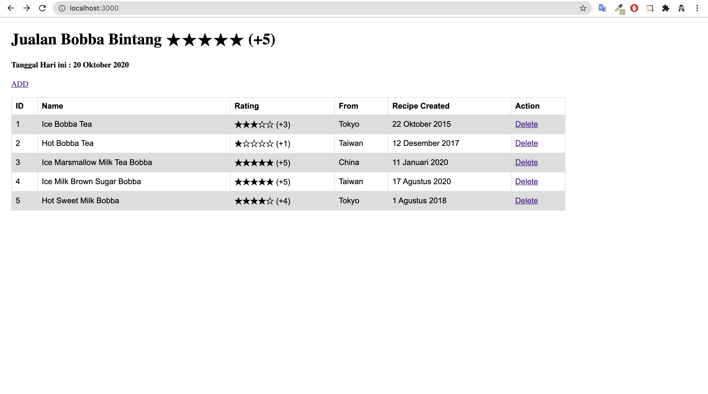
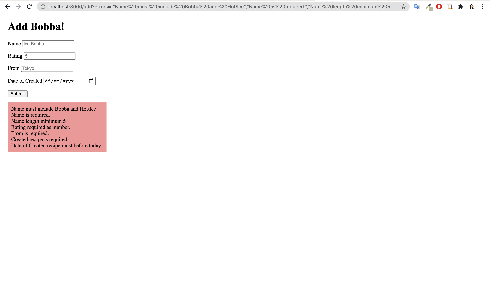

# Jualan Bobba Bintang 5

Table Drinks

| Column Name     | Data Type | Modifier           |
|-----------------|-----------|--------------------|
| name            | VARCHAR   | UNIQUE, NOT NULL   |
| rating          | iNTEGER   |                    |
| from            | VARCHAR   |                    |
| recipe_created  | DATE      |                    |


Data

| id | name                          | rating | from   | recipe_created |
|----|-------------------------------|--------|--------|----------------|
| 1  | Ice Bobba Tea                 | 3      | Tokyo  | 2015-10-22     |
| 2  | Hot Bobba Tea                 | 1      | Taiwan | 2017-12-12     |
| 3  | Ice Marsmallow Milk Tea Bobba | 5      | China  | 2020-01-11     |
| 4  | Ice Milk Brown Sugar Bobba    | 5      | Taiwan | 2020-08-17     |
| 5  | Hot Sweet Milk Bobba          | 4      | Tokyo  | 2018-08-01     |


Route

| Method | Route       | Description                                       |
|--------|-------------|---------------------------------------------------|
| GET    | /           | List of drinks in table                           |
| GET    | /add        | Get form add drink                                |
| POST   | /add        | Add new drink & redirect to /                     |
| POST   | /delete/:id | Delete drink by id with rating 1 & redirect to /  |

---

# Helper 
1. Buat helper rating bentuk angka menjadi emoji star dan apply view sehingga terlihat seperti ini 

2. Buat helper memformat date menjadi DD Month YYYY, namun Month dalam bahasa indonesia
```js
[
    'Januari', 'Februari', 'Maret', 'April' , 'Mei', 'Juni', 
    'July', 'Agustus', 'September', 'Oktober', 'November', 'Desember'
]
```
--- 

# Validation

Validasi terhadap nama, rating, from dan recipe_created! 

### Nama
- Tidak boleh kosong  
- Length lebih dari nama > 5 
- Harus memiliki kata 'ice', 'bobba' atau 'hot', 'bobba' 

### Rating
Tidak boleh kosong  
Rating harus angka bulat dari 1 s/d 5 

### From
Tidak boleh kosong 
Hanya boleh character dan number (no Symbol!)

### Recipe_crated
Tidak boleh kosong 
Date sudah pasti sebelum hari ini 


